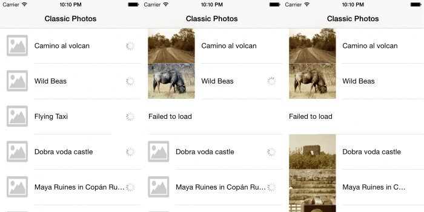

# Classic Photos

Angular photo list app built for the Picsum image-fetch task.

## Task

1. Show photos on the first page.
2. Add pagination for the same photo list.
3. Each cell should show an image and a label using the API response.

API:

```text
https://picsum.photos/v2/list?page=2&limit=100
```

Reference task image:



The API returns an array of image data, including image URLs and author names.

## Requirements Covered

- Shows a list of photos from the Picsum API.
- Each row displays the thumbnail on the left and the author name in the middle.
- Shows a loader on the right while each image is downloading.
- Hides the loader once the image has loaded.
- Retries failed image downloads up to 3 times.
- Shows a failed state after all retry attempts fail.
- Supports pagination for the fetched image list.
- Uses inheritance through `ImageService extends BaseApiService`.
- Keeps API logic encapsulated in services and UI logic inside components.

## Project Structure

```text
src/app/components/image-card       Single photo row
src/app/components/image-grid       Fetches, lists, and paginates photos
src/app/components/image-pagination Pagination controls
src/app/services/base-api.service   Shared HTTP/retry abstraction
src/app/services/image.service      Picsum API service
src/app/models/image.model.ts       App models and types
```

## Run Locally

Install dependencies:

```bash
npm install
```

Start the development server:

```bash
npm start
```

Open:

```text
http://localhost:4200/
```

## Build

```bash
npm run build
```

The production output is generated in:

```text
dist/ng-pixel-grid
```

## Tests

Run unit tests:

```bash
npm test
```

If ChromeHeadless fails to start on a local machine, check the local Chrome setup or browser launcher configuration.
