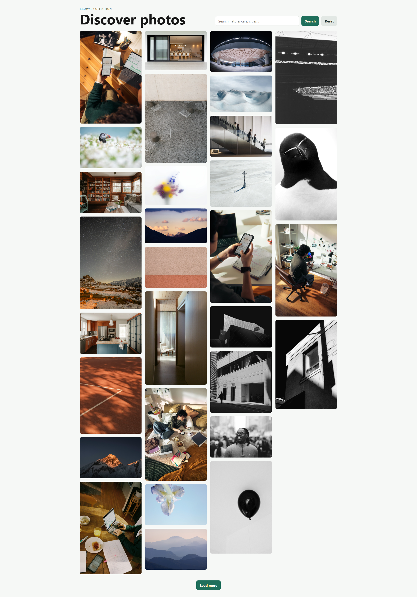
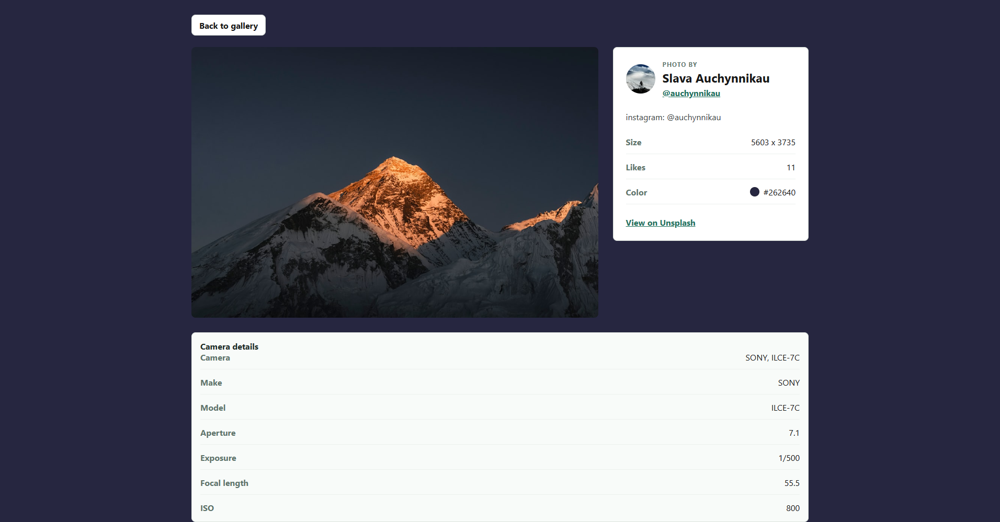
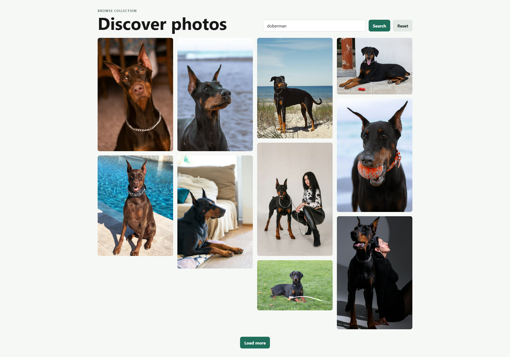
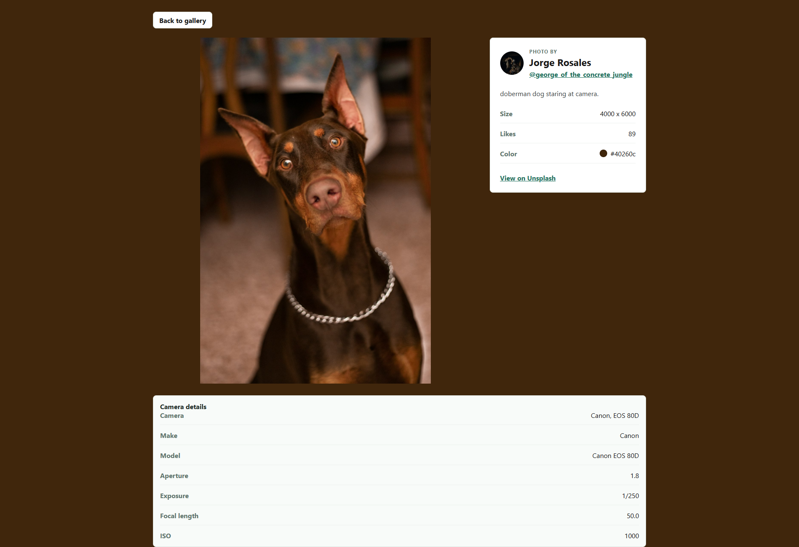

# Ng Pixora Gallery

Ng Pixora Gallery is an Angular 19 image gallery app powered by the Unsplash API. It lets users browse photos, search by keyword, load additional results, and open a detail page with photographer, image, color, size, likes, and camera metadata.

## Features

- Browse recent Unsplash photos in a responsive masonry-style gallery.
- Search photos by keyword with the search term preserved in the URL query string.
- Load more results with paginated Unsplash API requests.
- Open photo detail pages at `/photos/:id`.
- Return from a detail page back to the same gallery search.
- Display photographer attribution, Unsplash links, dominant color, image dimensions, likes, and EXIF camera data when available.
- Show loading, empty, and API error states.

## Tech Stack

- Angular 19
- Angular Router
- Angular standalone components
- Angular forms with `ngModel`
- Angular `HttpClient`
- RxJS
- SCSS
- Unsplash API

## Project Structure

```text
src/app/
  components/
    image-gallery/   Gallery view, search state, pagination, and photo cards
    image-search/    Search and reset form
    image-details/   Photo detail view and camera metadata
  interface/
    photos.ts        Unsplash response and photo interfaces
  service/
    unsplash.service.ts
  app.routes.ts      App routes
  app.config.ts      Router and HttpClient providers
```

## Routes

- `/` - photo gallery
- `/photos/:id` - selected photo details

The gallery also supports a `q` query parameter, for example:

```text
/?q=cities
```

## Screenshots

### Home Gallery



### Photo Details



### Search Results



### Search Details



## Unsplash API Setup

The app reads the Unsplash access key from:

```text
src/environments/environment.ts
src/environments/environment.prod.ts
```

Set `unsplashAccessKey` to your own Unsplash access key:

```ts
export const environment = {
  production: false,
  unsplashAccessKey: "YOUR_UNSPLASH_ACCESS_KEY",
};
```

You can create an Unsplash developer app from the Unsplash developer portal.

## Getting Started

Install dependencies:

```bash
npm install
```

Start the local development server:

```bash
npm start
```

Open:

```text
http://localhost:4200/
```

## Available Scripts

```bash
npm start
```

Runs the Angular development server.

```bash
npm run build
```

Builds the app into the `dist/` directory.

```bash
npm run watch
```

Builds in watch mode with the development configuration.

```bash
npm test
```

Runs unit tests with Karma and Jasmine.

## Build

Create a production build:

```bash
npm run build
```

The compiled output is written to:

```text
dist/ng-pixora-gallery/
```

## Notes

- Unsplash returns 10 photos per page from the current service configuration.
- Empty search terms reset the gallery to the default photo feed.
- API failures are normalized in `UnsplashService` before being shown in the UI.
