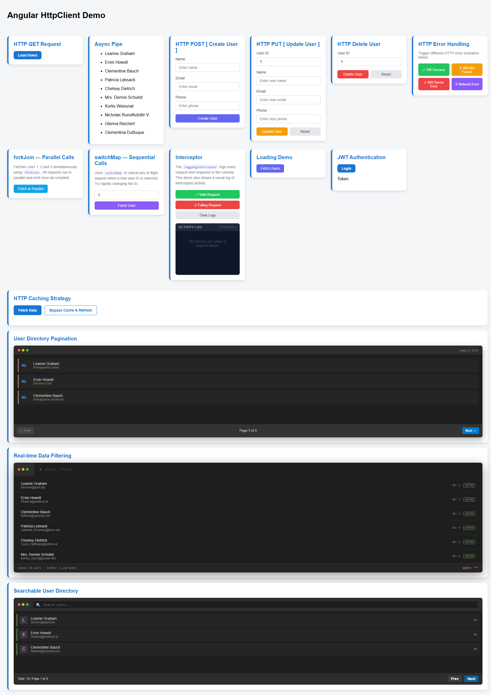

# Angular HttpClient Demo

Hands-on Angular 19 demo app that showcases common `HttpClient` patterns using JSONPlaceholder and a few focused UI cards.

## What This Project Demonstrates

The app renders multiple standalone demo components on a single page (no router navigation). Each card highlights one HTTP concept:

- `HTTP GET`: fetch and render users.
- `Async Pipe`: consume `Observable<User[]>` directly in template.
- `HTTP POST`: create a user from form input.
- `HTTP PUT`: update user by ID with basic ID validation.
- `HTTP DELETE`: delete user by ID and show success/error states.
- `HTTP Error Handling`: trigger success, 404, 500, and network failure scenarios.
- `forkJoin`: run parallel user requests and show total duration.
- `switchMap`: cancel previous in-flight user request when a new ID is requested.
- `Interceptors Demo`: request/response/error logging display.
- `Loading State`: artificial delay to visualize loading UX.
- `JWT Auth Demo`: fake login and token persistence in `localStorage`.
- `Caching`: cache-first fetch with explicit refresh.
- `Pagination`: client-side pagination of users.
- `Filtering`: realtime client-side filtering by name/email.
- `Search + Pagination`: combined filtering + paging with Angular signals.

## Architecture Notes

- Angular version: `19.2.x`
- Style: standalone components grouped and exported via `ComponentsModule`
- Root view: all demos mounted in `app.component.html`
- Data source: `https://jsonplaceholder.typicode.com/users`

### Services

- `UserService`: typed CRUD wrappers around JSONPlaceholder users endpoint + centralized HTTP error mapping.
- `AuthService`: fake login token handling via `localStorage`.
- `CacheService`: in-memory key/value cache.
- `CacheUserService`: cache-aware user fetch (`api` vs `cache` source).

### HTTP Interceptors (global)

Configured in `app.config.ts` via `provideHttpClient(withInterceptors(...))`:

- `loggingInterceptor`: logs request start, response time, and errors.
- `authInterceptor`: injects `Authorization: Bearer <token>` when token exists.
- `refreshInterceptor`: creates a fallback token if missing.

## Getting Started

### Prerequisites

- Node.js 18+ (or current LTS)
- npm

### Install

```bash
npm install
```

### Run

```bash
npm start
```

Open `http://localhost:4200/`.

## Scripts

- `npm start` - run dev server
- `npm run build` - production build
- `npm run watch` - build in watch mode
- `npm test` - run unit tests (Karma/Jasmine)

## Project Structure

```text
src/app/
  components/      # HTTP demo cards (standalone components)
  interceptor/     # logging, auth, token refresh interceptors
  models/          # User/Log/Cache response types
  service/         # user/auth/cache services
  shared/card/     # reusable card shell for demos
```

## Notes

- This project is intentionally demo-oriented and uses public mock endpoints.
- Most flows are client-side demonstrations (no real authentication backend).

## Screenshot


